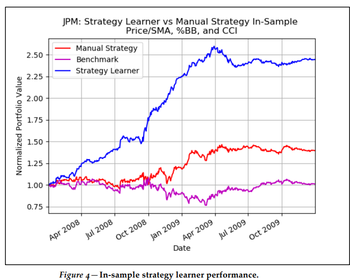
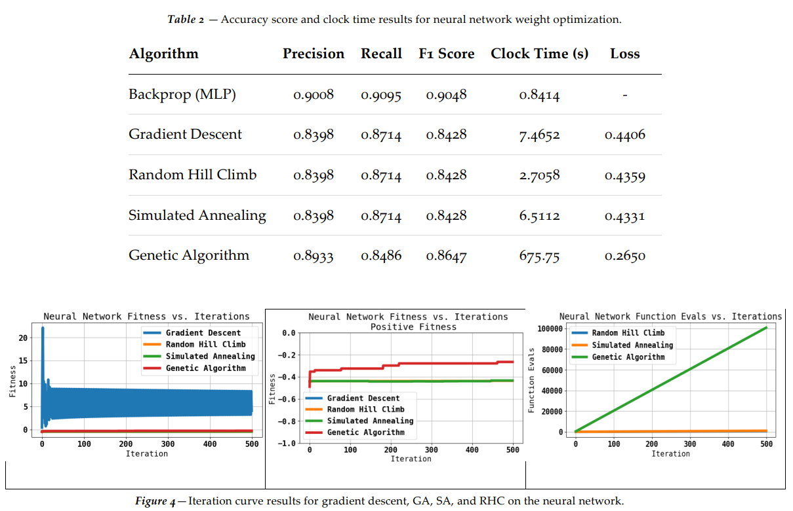
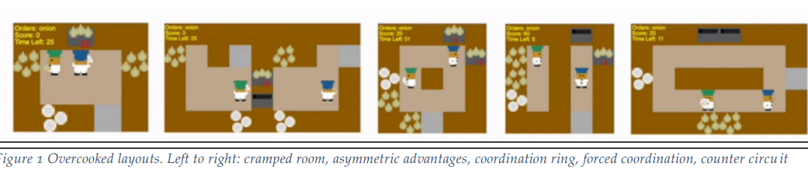
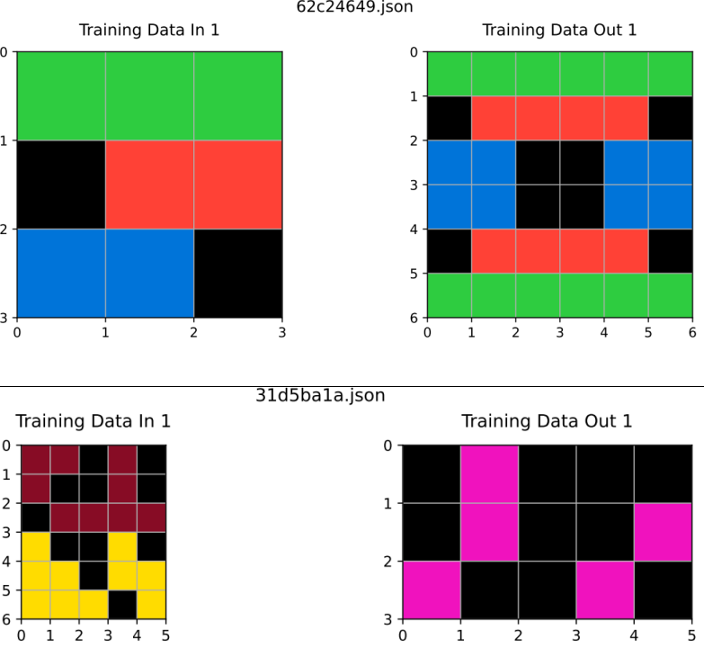
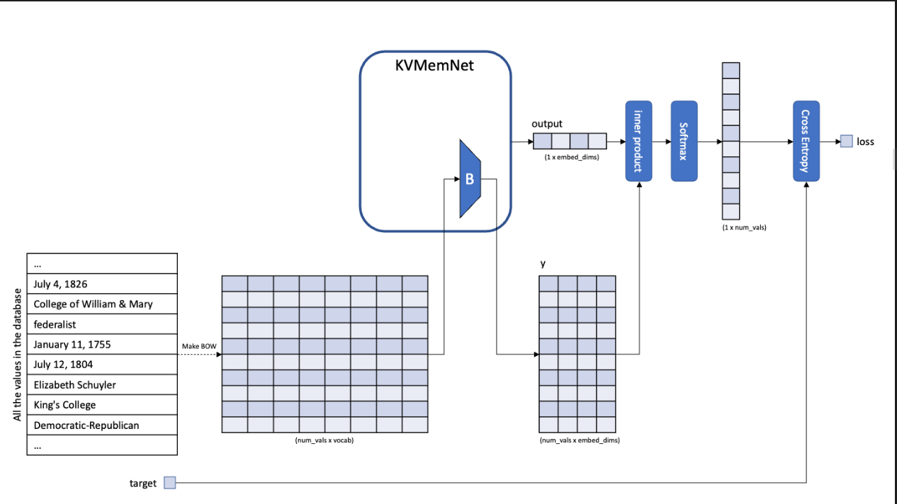
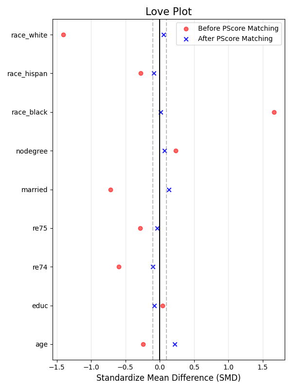
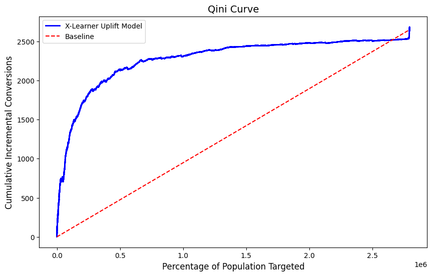

# Welcome!
Below is a collection of projects I've done in both my free time and as part of my MSCS coursework. Projects related to my professional work experience can be found on my [LinkedIn](https://www.linkedin.com/in/alaynanicholson/).

-------------------------

# [MSCS Technical Portfolio](https://github.com/anicholson6/MSCS-Portfolio) 
Detailed technical write-ups of my Georgia Tech OMSCS coursework (Jan 2023-Aug 2025). Each README discusses the problem statement, implementation strategies, and experimental results for a specific project. Courses include Machine Learning, Reinforcement Learning, Machine Learning for Trading, Natural Language Processing, and Knowledge Based AI. Click on each header for more details.

## [Machine Learning For Trading](https://github.com/anicholson6/MSCS-Portfolio/blob/main/Machine_Learning_For_Trading.md)
### Core Research Projects

| Project | Key Focus | Highlights |
| --- | --- | --- |
| **Algorithmic Learners** | From-Scratch Implementation | Developed custom Decision Tree, Random Tree, and Bootstrap Aggregating (Bagging) regression learners using only NumPy. |
| **Market Simulation** | Backtesting Engine | Built a robust simulation system to process trade orders, accounting for transaction costs, market impact, and portfolio tracking. |
| **Strategy Optimization** | Technical Analysis & RL | Engineered an automated "Strategy Learner" using Random Forests and Q-Learning to identify optimal trade signals based on technical indicators. |

---

## [Machine Learning](https://github.com/anicholson6/MSCS-Portfolio/blob/main/Machine_Learning.md)

### Core Research Projects

| Project | Key Focus | Highlights |
| --- | --- | --- |
| **Supervised Learning** | Algorithm Benchmarking | Comparative study of five core classifiers (MLP, SVM, KNN, Boosting, and Decision Trees) across varying data complexities.|
| **Randomized Optimization** | Stochastic Search | Analysis of RHC, Simulated Annealing, Genetic Algorithms, and MIMIC for discrete optimization and neural network weight fitting.|
| **Unsupervised Learning** | Dimensionality Reduction | Exploration of how PCA, ICA, RP, and UMAP impact clustering quality (K-Means/GMM) and model generalization.|

-----------------

## [Reinforcement Learning](https://github.com/anicholson6/MSCS-Portfolio/blob/main/Reinforcement_Learning.md)

### Core Research Projects

| Project | Key Focus | Highlights |
| --- | --- | --- |
| **Algorithm Replication** | Temporal Difference Learning | Replicated Richard Sutton’s seminal 1988 paper on , analyzing the impact of eligibility traces and step sizes () on prediction error within a bounded random walk MDP. |
| **Value-Based Learning** | Deep Q-Networks (DQN) | Implemented a DQN with experience replay and fixed target networks to optimize rocket trajectory control in the Lunar Lander environment. |
| **Multi-Agent Systems** | Cooperative Coordination | Engineered a Multi-Agent PPO (MAPPO) system with a centralized critic to coordinate two agents in the complex, collaborative Overcooked_AI environment. |

-----------
## [Knowledge Based AI](https://github.com/anicholson6/MSCS-Portfolio/blob/main/Knowledge_Based_AI.md)

### Core Research Projects

| Project | Key Focus | Highlights |
| --- | --- | --- |
| **ARC-AGI Agent** | Abstract Reasoning | Developed a knowledge-based agent utilizing a Domain Specific Language (DSL) to solve abstract visual reasoning tasks from the Abstraction and Reasoning Corpus. |

----------------------
## [Natural Language Processing](https://github.com/anicholson6/MSCS-Portfolio/blob/main/Reinforcement_Learning.md)

### Core Research Projects

| Project | Key Focus | Highlights |
| --- | --- | --- |
| **Neural Text Classification** | Sentiment & Topic Analysis | Implemented and compared Naive Bayes, Logistic Regression, and Multi-layer Perceptrons with Dropout regularization for robust text categorization.|
| **Sequence Modeling** | RNNs & LSTMs | Built character and word-level language models from scratch, implementing manual LSTM gates to achieve a test perplexity of 498.22 on complex literary corpora.|
| **Attention & Memory** | Key-Value Memory Networks | Engineered a neural question-answering system from scratch using dot-product attention to retrieve information from an external key-value database.|

----------------------

# Personal Projects 

## [Solar Energy Accessibility Analysis](https://github.com/anicholson6/Personal-Portfolio/tree/main/DS4A_Capstone) 
Group capstone for the Data Science for All program. We used a multi-source data approach to identify market barriers and regional adoption trends for residential solar energy. Our findings were presented as a report, datafolio, and Tableau dashboard.

[Tableau Report](https://public.tableau.com/app/profile/ds4a.team.144847/viz/AccessibilityAffordabilityofSolarEnergyintheUS/SolarenergyintheU_S)

## [Propensity Score Matching](https://github.com/anicholson6/Personal-Portfolio/tree/main/propensity_match) 
Determine whether a job training program had a positive effect on employees' future earnings vs a control. Used propensity score matching to remove covariant imbalance before determining whether the skewed treated group had an actual incremental lift.

## [Uplift  Modeling](https://github.com/anicholson6/Personal-Portfolio/tree/main/uplift-models) 
Use uplift modeling to identify customers that will make a conversion if exposed to an ad, and determine the incremental gain over a control group. Method was compared across three meta learners - S, T, and X - to identify the top decile of customers.

